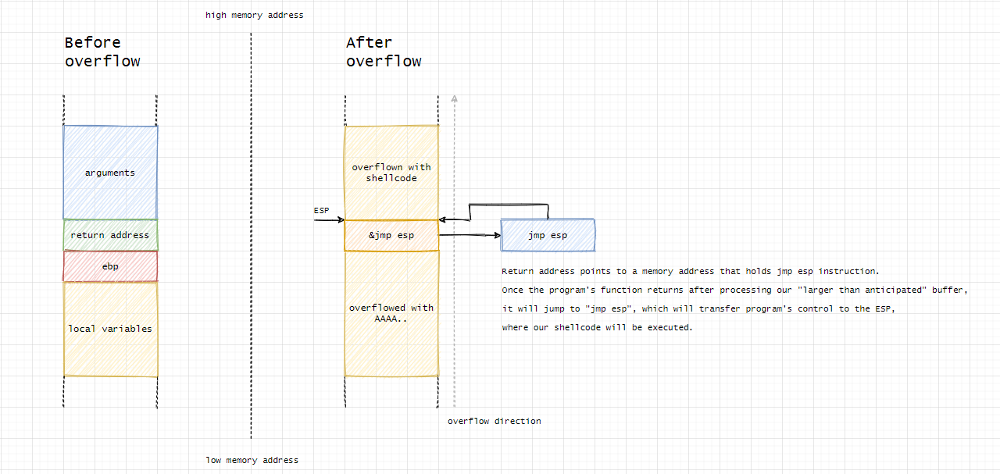

# Hole-in-Bin Exploitation Challenges

## Overview

### What is Binary Exploitation?

Binary exploitation involves manipulating a binary executable (often compiled from C/C++ code) to achieve unintended behavior. This can include executing arbitrary code, altering the flow of execution, or bypassing security mechanisms. Binary exploitation techniques are used by both security researchers to identify vulnerabilities and by attackers to exploit them. Understanding binary exploitation is crucial for developing secure software and defending against malicious attacks.

### What is a Buffer Overflow?

A buffer overflow occurs when more data is written to a buffer than it can hold. This extra data can overwrite adjacent memory, which can be exploited to alter the execution flow of a program. Buffer overflows are particularly dangerous because they can corrupt the memory of an application and allow attackers to execute arbitrary code.

#### How Buffer Overflow Works

1. **Buffer Allocation**: In many programs, buffers are used to store data temporarily. If the buffer is not properly bounded, writing more data than the buffer can hold will overflow into adjacent memory.
2. **Overwriting Memory**: When a buffer overflow occurs, the data written beyond the buffer can overwrite important data such as function pointers, return addresses, or other variables.
3. **Controlling Execution Flow**: By carefully crafting the overflow data, an attacker can overwrite the return address on the stack. This allows the attacker to control where the program jumps when the current function returns.
4. **Injecting Payloads**: The attacker can include shellcode or other malicious payloads in the overflow data, which can then be executed when the execution flow is redirected.

In the image above:
- Before overflow, the stack contains function arguments, return address, base pointer (ebp), and local variables.
- After overflow, the return address is overwritten with the address of a "jmp esp" instruction, redirecting execution to the shellcode placed earlier in the buffer.

#### Types of Buffer Overflows

- **Stack-based Buffer Overflow**: Occurs in the call stack, often leading to the overwriting of the return address or other control data.
- **Heap-based Buffer Overflow**: Occurs in the heap memory, used for dynamically allocated memory, and can lead to corruption of heap management data structures.

### How to Identify Vulnerabilities

To identify buffer overflow vulnerabilities, look for:

- **Unsafe Functions**: Functions known to be unsafe, such as `gets`, `strcpy`, `sprintf`, and `scanf`, are often involved in buffer overflows. These functions do not perform bounds checking and can lead to overflows if the input data exceeds the buffer size.
- **Lack of Boundary Checks**: Absence of boundary checks before writing data into buffers. Proper validation and sanitization of input data are essential to prevent overflows.
- **Fixed-size Buffers**: Fixed-size buffers in functions that handle external input can be a sign of potential buffer overflow vulnerabilities. Ensure that buffers are appropriately sized and that input data is validated.

### Using Python for Exploitation

Python can be used to craft payloads for exploitation due to its capabilities in handling binary data and automating repetitive tasks. The `struct` module in Python is particularly useful for creating binary data in specific formats required for exploitation.

#### Why Use Python?

- **Automating Payload Creation**: Python scripts can be used to automate the creation of complex payloads, making it easier to test different inputs and conditions. Automation is key in efficiently identifying and exploiting vulnerabilities.
- **Handling Binary Data**: Python's `struct` module allows for easy manipulation and packing of binary data, which is crucial for creating payloads that need to overwrite specific memory addresses. This capability makes Python an ideal choice for crafting precise exploitation payloads.
- **Scripting Repetitive Tasks**: Many exploitation tasks involve repetitive steps that can be efficiently automated with Python scripts. This includes tasks such as sending payloads, parsing responses, and performing memory calculations.

### Resources

- [Buffer Overflow Exploitation](https://www.exploit-db.com/docs/english/28476-linux-format---understanding-buffer-overflows.pdf): A comprehensive guide on understanding and exploiting buffer overflows.
- [GDB Debugger](https://www.gnu.org/software/gdb/documentation/): The GNU Project Debugger (GDB) documentation. GDB is an essential tool for analyzing binaries and debugging programs.
- [Binary Exploitation Resources](https://github.com/kevinweaver/awesome-binary-exploitation): A curated list of resources and tools for binary exploitation.

---

## Exercises

This section contains links to detailed walkthroughs for each exercise. Each exercise focuses on a different aspect of binary exploitation, providing step-by-step instructions and explanations.

- [ex00](./ex00/README.md): Exploiting a simple buffer overflow to change a variable.
- [ex01](./ex01/README.md): Modifying a variable using a buffer overflow and specific input data.
- [ex02](./ex02/README.md): Exploiting an environment variable-based buffer overflow.
- [ex03](./ex03/README.md): Changing code flow by overwriting function pointers using a buffer overflow.
- [ex04](./ex04/README.md): [Description of ex04 exercise and its objective.]

Each exercise directory contains:

- **README.md**: Detailed steps, explanations, and Python scripts used for the exploitation.
- **bin**: The binary file to be exploited.
- **images**: (Optional) Images illustrating the steps and outputs during the exploitation process.

---

## Structure

Here's an overview of the directory structure for the project:

